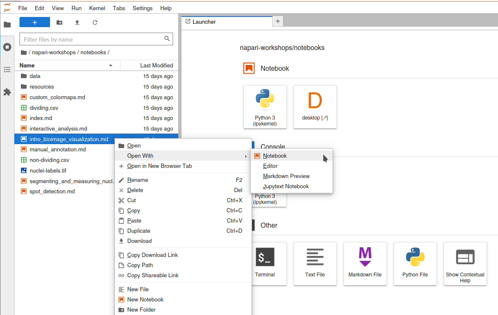

# Running napari in the Cloud

If you can't install napari and the Jupyter notebook application locally, or if you prefer using a cloud instance of Jupyter to execute and interact with the workshop notebooks, you have two options for running everything in the cloud.

```{tip}
For the best experience, we recommend installing and running napari on your local machine following the [installation guide](installation.md). However, cloud options can be useful for workshops, tutorials, or when local installation is not feasible.
```

## Option 1: SciPy 2025 Nebari Instance (Recommended if available)

If you are attending SciPy 2025 or have access to a Nebari JupyterHub instance, this is the recommended cloud option for the best performance.

### Getting Started with Nebari

Log into the SciPy 2025 Nebari instance following the instructions provided by the organizers.

```{note}
If the conference has already ended and the Nebari instance is no longer available, please see Option 2 below for using Binder.
```

Once logged in to Nebari, click on the **JupyterLab** card to open the JupyterLab interface. You will be prompted to select an instance type. Please select the instance labeled **Medium Instance (MyST)**; we will not be leveraging GPU acceleration.

### Open a Desktop Tab

Once the JupyterLab interface is open, you should see the typical Launcher tab with a number of tiles, e.g. for creating a new notebook, accessing the terminal, etc. Look for the tile labeled "Desktop":


Click on the "Desktop" tile, which will open a new browser tab with a remote desktop interface to a basic Linux desktop. 


By moving your mouse pointer inside this desktop interface, you should be able to interact with it. We will use this browser tab and desktop within it to host the napari GUI window spawned by the Jupyter notebook cells used throughout this workshop.

Now that our desktop is set up, we can proceed to running code!

### Access Workshop Materials

To access the workshop materials, you can select the workshop repository in the Tutorials section of the JupyterLab Launcher "Create custom image visualization and analysis tools with napari".  

Alternately, you can use the Git integration in the left-most sidebar and click the "Clone a Repository" button.


For the repository address, enter the following URL:
```
https://github.com/napari/napari-workshops
```

Once you have the materials cloned, you should see a directory named `napari-workshops` in the file browser tab, which can be accessed by the top-most button, the Folder icon, in the left-most sidebar. You can navigate to the workshop folders to find all the workshop materials.

```{important}
To open workshop notebooks such that they are runnable in the Jupyter interface, you must:

* Right click the notebook name in the file navigation panel from the Jupyter interface
* Click "Open with -> Notebook".



Note that all of these notebooks contain a code cell "`Nebari` and `Binder` setup" at the start which needs to be run to enable the napari window to be displayed in the Nebari Desktop tab. 
```

After running any cell which opens the napari viewer from the Jupyter notebook, you should now see the napari GUI window in the Desktop tab on your browser!

#### Creating a Notebook from Scratch

If you want to start from scratch with an empty notebook, then you need to ensure that you execute the following code cell **in your notebook** to enable napari to display its GUI window in the Desktop tab:

```python
import os
os.environ['DISPLAY'] = ':1.0'
```

*You will need to run this cell in every new notebook you create!*

## Option 2: Binder (Free, but limited performance)

If you don't have access to a Nebari instance, you can use [mybinder.org](https://mybinder.org) to run the workshop materials in the cloud. 

```{warning}
Because Binder launches a virtual machine in the cloud and installs everything needed to run the notebook, it could take *several minutes* to spin up! Additionally, 3D rendering performance will be severely limited on this free resource.
```

### Open a Notebook in Binder

To open a notebook in Binder, click on the rocketship badge at the top of a notebook and click on "Binder".


This will open the notebook in Markdown format, **but it will not be runnable**. Further, because napari is a desktop application, we need a "Desktop" tab to see the napari GUI interface. To do this, close the Markdown notebook to return to the Jupyter launcher tab.

### Open Desktop Tab

In the Jupyter launcher tab, click on the "Desktop" tile (marked with `D`).


After this, you should see a new tab open up in your browser window called "Jupyter Remote Desktop Proxy", with a basic Linux desktop interface. 

```{note}
If at first it doesn't connect, just close the tab and click the `D` tile a second time.
```


By moving your mouse pointer inside this desktop interface, you should be able to interact with it. We will use it to host the napari GUI window.

### Run Notebook Cells

Now that our desktop is set up, we can proceed to running each of the cells in the notebook. You can access them from the file browser on the left side.

```{important}
To open these workshop notebooks in this Jupyter interface, right click the notebook name in the file navigation panel from the Jupyter interface, and click "Open with -> Notebook".


Additionally, all of these notebooks contain a code cell which needs to be run to enable the napari window to be displayed in the Binder Desktop tab:

```python
import os
if 'BINDER_SERVICE_HOST' in os.environ:
    os.environ['DISPLAY'] = ':1.0'
```
```

After running any cell which opens the napari viewer from the Jupyter notebook, you should now see the napari GUI window in the Desktop tab on your browser.

### Interact with the Notebooks!

You should now be able to interact with the notebooks, by executing all cells and observing the results in the napari GUI window. You can also edit the code cells to experiment with different napari concepts and its API. You can save a snapshot of the viewer status to the notebook using the `nbscreenshot` function.

## Troubleshooting Cloud Setups

### napari window not appearing

If the napari window doesn't appear in your Desktop tab:

1. Make sure you ran the setup cell at the beginning of the notebook
2. Verify the Desktop tab is open and active
3. Try clicking in the Desktop tab to ensure it has focus
4. If using Binder, try restarting the kernel and running cells again

### Performance issues

Cloud environments may have limited resources:

- 3D rendering will be slower than on a local machine
- Large datasets may cause memory issues
- Consider working with smaller image crops for better performance

### Session timeouts

Both Nebari and Binder sessions will timeout after inactivity:

- Save your work frequently
- Be aware that unsaved changes will be lost
- You may need to restart your session and re-run cells
